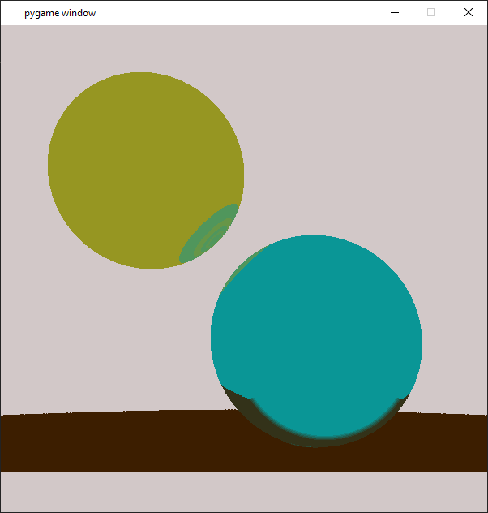

# Path-Tracer
A Path Tracing engine I wrote using Python 3.8 and Pygame 2.

It's still a very much work in progress as I still want to do the following:
<li> Clean up the structure of my code <strong><- In Progress</strong>
<li> Speed up rendering times
<li> Add colour to the spheres <strong><- In Progress</strong>
<li> Add reflections <strong><- In Progress</strong>
<li> Clean up light colours to be more smooth
 

